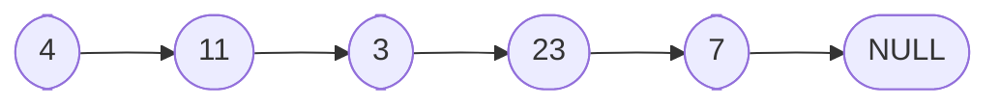
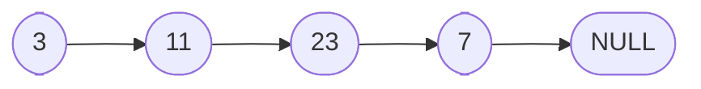

# Linked Lists

To start off, we will compare linked lists with the most often compared to data structure, arrays.

**Array**:

|       |     |     |     |     |
| ----- | --- | --- | --- | --- |
| Value | 11  | 3   | 23  | 7   |
| Index | 0   | 1   | 2   | 3   |

- Arrays have indexes, which means that each element in the array can be accessed using its index. For example, to access the first element in the array, we can use `array[0]`.
- Arrays are stored in contiguous memory locations, which means that the elements are stored next to each other in memory.

**Linked List**:

- Linked lists do not have indexes, which means that each element in the linked list cannot be accessed using its index.
- Linked lists are not store in contiguous memory locations, which means that the elements are not stored next to each other in memory.
- Linked lists have a variable `head` pointer, which points to the first element in the linked list.
- Linked lists have a variable `tail` pointer, which points to the last element in the linked list.
- Each item in the linked list is called a node and each point to the next node in the linked list. The last node in the linked list points to `null`, which indicates the end of the linked list.
- We will hear the phrase "null terminated" list, which means that the last node in the linked list points to `null`.

Again, arrays are in contiguous memory locations, which means that the elements are stored next to each other in memory. In contrast, linked lists are not stored in contiguous memory locations, which means that the elements are not stored next to each other in memory. This means that linked lists can grow and shrink in size dynamically, while arrays have a fixed size. This is one of the main advantages of linked lists over arrays.

## Linked List: Big-O Notation


**Adding to the end of a linked list**:


To add to the end of a linked list, we would have the last node point to the new node and have the tail variable point to the new node.

It does not matter if the linked list have 4 nodes or 4 million nodes, the number of steps are always constant. This means that the time complexity of adding to the end of

**Removing from the end of a linked list**:

We would think that all we have to do to remove a node from the end is to do the reverse of adding to the end. But this is not the case. In order to have the tail point to the second to last node, we would have to set it equal to a node that is pointing to the second to last node. We cannot go backwards in a linked list, so we would have to traverse the entire linked list to find the second to last node.

Popping from the end of a linked list is O(n) because we have to traverse the entire linked list to find the second to last node.

**Adding to the front of a linked list**:



Let's say we want to add `4` to the front of the linked list. We would have to have this new node point to the first node in the linked list and have the head variable point to the new node.

We would set the pointer for the new node point to the `head` node and then set the `head` variable to the new node.

This is O(1) because we are not traversing the entire linked list, we are just changing the `head` pointer.

**Removing from the front of a linked list**:



To remove from the front of a linked list, we would have to set the `head` variable to the second node in the linked list. We can do this by setting the `head` pointer variable to `head.next`.

This is O(1) because we are not traversing the entire linked list, we are just changing the `head` pointer.

**Adding to the middle of a linked list**:

In order to add to the middle of a linked list, we would have to iterate through the linked list to find the node that we want to add after.

Let's say we want to add `4` after `23`. We would have to have the `4` node point to the same node that `23` is pointing to and then have the `23` node point to the `4` node.

Because we had to start at the head and iterate through the linked list to find the node that we want to add after, this is O(n) because we have to traverse the entire linked list to find the node that we want to add after.

**Removing from the middle of a linked list**:

To remove from the middle of a linked list, we would have to iterate through the linked list to find the node that we want to remove. We would want to set the previous node point to the same node that the node we want to remove is pointing to. We can do this by setting the previous node's pointer to the node that we want to remove's next pointer.

This is O(n) because we have to traverse the entire linked list to find the node that we want to remove.

**Finding a node in a linked list**:

We can find an item by its value or by its index. To find an item by its value, we would have to iterate through the linked list to find the node that we want to find. This is O(n) because we have to traverse the entire linked list to find the node that we want to find.

We can also find an item by its index. To find an item by its index, we would have to iterate through the linked list to find the node that we want to find. This is O(n) because we have to traverse the entire linked list to find the node that we want to find.

Whether we are finding an item by its value or by its index, we have to traverse the entire linked list to find the node that we want to find. This is O(n) because we have to traverse the entire linked list to find the node that we want to find.

**Arrays vs Linked Lists**:

| Operation       | Array | Linked List |
| --------------- | ----- | ----------- |
| Push            | O(1)  | O(1)        |
| Pop             | O(1)  | O(n)        |
| Shift           | O(n)  | O(1)        |
| Unshift         | O(n)  | O(1)        |
| Insert          | O(n)  | O(n)        |
| Delete          | O(n)  | O(n)        |
| Lookup by index | O(1)  | O(n)        |
| Lookup by value | O(n)  | O(n)        |

## Linked List: Under the Hood


What is a linked list really made of? Let's say we are trying to add `4` to the linked list.What does it mean when we say the `7` node points to the `4` node? And, when we say that `tail` points to the `4` node, what's really going on?

In order to understand linked lists, we have to know what is a `node` made up of. A `node` is made up of two parts: a value and a pointer. The value is the data that we want to store in the linked list and the pointer is the address of the next `node` in the linked list.

The `node` is actually an object that has two properties: `value` and `next`.

For example, the `4` node would look like this:

```javascript
{
  value: 4,
  next: null,
}
```

and the `7` node would look like this:

```javascript
{
  value: 7,
  next: null,
}
```

How do we the `7` node point to the other node? We can do it by setting the `next` property of the `7` node to the address of the `4` node. This is how we can have the `7` node point to the `4` node.

```javascript
{
  value: 7,
  next: {
    value: 4,
    next: null,
  },
}
```

This is the same for the other nodes in the linked list. The whole linked list would look like this:

```javascript
{
  value: 11,
  next: {
    value: 3,
    next: {
      value: 23,
      next: {
        value: 7,
        next: {
          value: 4,
          next: null,
        },
      },
    },
  },
}
```

The `head` variable would point to the first node in the linked list and the `tail` variable would point to the last node in the linked list.

```javascript
 {
  head: {
  value: 11,
    next: {
      value: 3,
      next: {
        value: 23,
        next: {
          value: 7,
          next: {
            value: 4,
            next: null,
          },
        },
      },
    },
  }
}
```

```javascript
const tail = {
  value: 4,
  next: null,
}
```

This is what a linked list looks like under the hood. Each node is an object that has two properties: `value` and `next`. The `next` property points to the next node in the linked list. The `head` variable points to the first node in the linked list and the `tail` variable points to the last node in the linked list.
