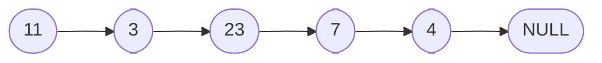
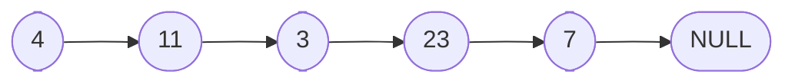

# Linked Lists

To start off, we will compare linked lists with the most often compared to data structure, arrays.

**Array**:

|       |     |     |     |     |
| ----- | --- | --- | --- | --- |
| Value | 11  | 3   | 23  | 7   |
| Index | 0   | 1   | 2   | 3   |

- Arrays have indexes, which means that each element in the array can be accessed using its index. For example, to access the first element in the array, we can use `array[0]`.
- Arrays are stored in contiguous memory locations, which means that the elements are stored next to each other in memory.

**Linked List**:

- Linked lists do not have indexes, which means that each element in the linked list cannot be accessed using its index.
- Linked lists are not store in contiguous memory locations, which means that the elements are not stored next to each other in memory.
- Linked lists have a variable `head` pointer, which points to the first element in the linked list.
- Linked lists have a variable `tail` pointer, which points to the last element in the linked list.
- Each item in the linked list is called a node and each point to the next node in the linked list. The last node in the linked list points to `null`, which indicates the end of the linked list.
- We will hear the phrase "null terminated" list, which means that the last node in the linked list points to `null`.

Again, arrays are in contiguous memory locations, which means that the elements are stored next to each other in memory. In contrast, linked lists are not stored in contiguous memory locations, which means that the elements are not stored next to each other in memory. This means that linked lists can grow and shrink in size dynamically, while arrays have a fixed size. This is one of the main advantages of linked lists over arrays.

## Linked List: Big-O Notation


**Adding to the end of a linked list**:




To add to the end of a linked list, we would have the last node point to the new node and have the tail variable point to the new node.

It does not matter if the linked list have 4 nodes or 4 million nodes, the number of steps are always constant. This means that the time complexity of adding to the end of

**Removing from the end of a linked list**:

We would think that all we have to do to remove a node from the end is to do the reverse of adding to the end. But this is not the case. In order to have the tail point to the second to last node, we would have to set it equal to a node that is pointing to the second to last node. We cannot go backwards in a linked list, so we would have to traverse the entire linked list to find the second to last node.

Popping from the end of a linked list is O(n) because we have to traverse the entire linked list to find the second to last node.

**Adding to the front of a linked list**:



Let's say we want to add `4` to the front of the linked list. We would have to have this new node point to the first node in the linked list and have the head variable point to the new node.

We would set the pointer for the new node point to the `head` node and then set the `head` variable to the new node.

This is O(1) because we are not traversing the entire linked list, we are just changing the `head` pointer.

**Removing from the front of a linked list**:


To remove from the front of a linked list, we would have to set the `head` variable to the second node in the linked list. We can do this by setting the `head` pointer variable to `head.next`.

This is O(1) because we are not traversing the entire linked list, we are just changing the `head` pointer.

**Adding to the middle of a linked list**:

In order to add to the middle of a linked list, we would have to iterate through the linked list to find the node that we want to add after.

Let's say we want to add `4` after `23`. We would have to have the `4` node point to the same node that `23` is pointing to and then have the `23` node point to the `4` node.

Because we had to start at the head and iterate through the linked list to find the node that we want to add after, this is O(n) because we have to traverse the entire linked list to find the node that we want to add after.

**Removing from the middle of a linked list**:

To remove from the middle of a linked list, we would have to iterate through the linked list to find the node that we want to remove. We would want to set the previous node point to the same node that the node we want to remove is pointing to. We can do this by setting the previous node's pointer to the node that we want to remove's next pointer.

This is O(n) because we have to traverse the entire linked list to find the node that we want to remove.

**Finding a node in a linked list**:

We can find an item by its value or by its index. To find an item by its value, we would have to iterate through the linked list to find the node that we want to find. This is O(n) because we have to traverse the entire linked list to find the node that we want to find.

We can also find an item by its index. To find an item by its index, we would have to iterate through the linked list to find the node that we want to find. This is O(n) because we have to traverse the entire linked list to find the node that we want to find.

Whether we are finding an item by its value or by its index, we have to traverse the entire linked list to find the node that we want to find. This is O(n) because we have to traverse the entire linked list to find the node that we want to find.

**Arrays vs Linked Lists**:

| Operation       | Array | Linked List |
| --------------- | ----- | ----------- |
| Push            | O(1)  | O(1)        |
| Pop             | O(1)  | O(n)        |
| Shift           | O(n)  | O(1)        |
| Unshift         | O(n)  | O(1)        |
| Insert          | O(n)  | O(n)        |
| Delete          | O(n)  | O(n)        |
| Lookup by index | O(1)  | O(n)        |
| Lookup by value | O(n)  | O(n)        |

## Linked List: Under the Hood


What is a linked list really made of? Let's say we are trying to add `4` to the linked list.What does it mean when we say the `7` node points to the `4` node? And, when we say that `tail` points to the `4` node, what's really going on?

In order to understand linked lists, we have to know what is a `node` made up of. A `node` is made up of two parts: a value and a pointer. The value is the data that we want to store in the linked list and the pointer is the address of the next `node` in the linked list.

The `node` is actually an object that has two properties: `value` and `next`.

For example, the `4` node would look like this:

```javascript
{
  value: 4,
  next: null,
}
```

and the `7` node would look like this:

```javascript
{
  value: 7,
  next: null,
}
```

How do we the `7` node point to the other node? We can do it by setting the `next` property of the `7` node to the address of the `4` node. This is how we can have the `7` node point to the `4` node.

```javascript
{
  value: 7,
  next: {
    value: 4,
    next: null,
  },
}
```

This is the same for the other nodes in the linked list. The whole linked list would look like this:

```javascript
{
  value: 11,
  next: {
    value: 3,
    next: {
      value: 23,
      next: {
        value: 7,
        next: {
          value: 4,
          next: null,
        },
      },
    },
  },
}
```

The `head` variable would point to the first node in the linked list and the `tail` variable would point to the last node in the linked list.

```javascript
 {
  head: {
  value: 11,
    next: {
      value: 3,
      next: {
        value: 23,
        next: {
          value: 7,
          next: {
            value: 4,
            next: null,
          },
        },
      },
    },
  }
}
```

```javascript
const tail = {
  value: 4,
  next: null,
}
```

This is what a linked list looks like under the hood. Each node is an object that has two properties: `value` and `next`. The `next` property points to the next node in the linked list. The `head` variable points to the first node in the linked list and the `tail` variable points to the last node in the linked list.

## Linked List: Constructor

```javascript
class LinkedList {
  // creates a new node
  constructor(value) {}

  // creates a new node and adds it to the end of the linked list
  push(value) {}

  // creates a new node and adds it to the front of the linked list
  unshift(value) {}

  // creates a new node and add it to whatever index we want
  insert(index, value) {}
}
```

The `constructor` method has a couple of things in common with the other methods that we are going to build.

- They each get passed a `value` parameter.
- They each create a new node.

We can see that all of the methods are going to create a new node. So, we can create another class `Node` that will create a new node. This will help us keep our code DRY (Don't Repeat Yourself).

Reminder: when we are creating a `node`, we are creating an object that has two properties: `value` and `next`.

```javascript
class Node {
  constructor(value) {
    this.value = value
    this.next = null
  }
}
```

We pass the `constructor` a `value` parameter and set the `value` property to the value that we passed it. We also set the `next` property to `null` because we don't want to point to anything yet.

We can use this `Node` class like so:

```javascript
const node = new Node(4)
console.log(node) // { value: 4, next: null }
```

Now, going back to the `LinkedList` class and focusing on the `constructor` method:

```javascript
class LinkedList {
  // creates a new node
  constructor(value) {
    // create a new node
    const node = new Node(value)

    // set the head to the new node
    this.head = node

    // set the tail to the new node
    this.tail = node

    // keep track of the length of the linked list
    this.length = 1
  }
}
```

The `LinkedList` constructor method creates a new node and sets the `head` and `tail` properties to the new node. It also keeps track of the length of the linked list by setting the `length` property to `1`. This is because we have just created a new node and added it to the linked list.

Now with all the pieces in place, we can create a new linked list like so:

```javascript
const linkedList = new LinkedList(4)
console.log(linkedList) // { head: { value: 4, next: null }, tail: { value: 4, next: null }, length: 1 }
```

This creates a new linked list with one node that has a value of `4`. The `head` and `tail` properties point to the same node and the `length` property is set to `1`.

## Linked List: Push

```javascript
push(value) {
  // create a new node with the value passed to the method
  const node = new Node(value)

  // step 1: check if the linked list is empty
  if (!this.head) {
    // if this.head is null (the linked list is empty)
    this.head = node // set the head to the new node
    this.tail = node // set the tail to the new node
  } else {
    // if this.head is not null (the linked list is not empty)
    this.tail.next = node // set the tail's next property to the new node
    this.tail = node // set the tail to the new node
  }

  this.length++ // increment the length of the linked list
  return this // return the linked list
}
```

The `push` method creates a new node with the value passed to the method. It then checks if the linked list is empty by checking if the `head` property is `null`.

- If it is, it sets the `head` and `tail` properties to the new node.
- If it is not, it sets the `tail.next` property to the new node and sets the `tail` property to the new node.

Finally, it increments the length of the linked list and returns the linked list.

## Linked List: Pop

We are only going to go through the logic of the `pop` method. We will go through the code in the next section.

With the `pop` method, we remove the last node in the linked list and move the `tail` pointer to the second to last node in the linked list. Finally, we return the removed node.

We do have a couple of edge cases to consider:

- If the linked list is empty, we want to return `undefined`.
- If the linked list has only one node, we want to set the `head` and `tail` properties to `null` and return the removed node.

To implement this, we will create two variables: `prev` and `temp`. The `prev` variable will point to the second to last node in the linked list and the `temp` variable will point to the last node in the linked list. We will then set the `prev.next` property to `null` and set the `tail` property to `prev`. Finally, we will return the removed node.

## Linked List: Pop (Code)

```javascript
pop() {
  let temp = this.head // create a temp variable to point to the head of the linked list
  let prev = this.head // create a prev variable to point to the second to last node in the linked list


  if (!this.head) return undefined // if the linked list is empty, return undefined

  while(temp.next) {
    pre = temp // set prev to temp
    temp = temp.next // set temp to the next node in the linked list
  }

  this.tail = prev // set the tail to the second to last node in the linked list
  this.tail.next = null // set the tail's next property to null

  this.length-- // decrement the length of the linked list

  if (this.length === 0) {
    this.head = null // if the linked list is empty, set the head to null
    this.tail = null // if the linked list is empty, set the tail to null
  }

  return temp // return the removed node
}
```

## Linked List: Unshift

Unshift is the opposite of push. It adds a new `node` to the front of the linked list.

We want the new `node` to point to the current head and then set the head to the new `node`. We also want to increment the length of the linked list.

```javascript
unshift(value) {
  const node = new Node(value) // create a new node with the value passed to the method

  if (!this.head) {
    this.head = node // if the linked list is empty, set the head to the new node
    this.tail = node // if the linked list is empty, set the tail to the new node
  } else {
    node.next = this.head // set the new node's next property to the current head
    this.head = node // set the head to the new node
  }

  this.length++ // increment the length of the linked list
  return this // return the linked list
}
```

Explanation:

- We create a new `node` with the value passed to the method.
- If the linked list is empty, we set the `head` and `tail` properties to the new `node`.
- If the linked list is not empty, we set the new `node`'s `next` property to the current `head` and set the `head` to the new `node`.
- Finally, we increment the length of the linked list and return the linked list.

## Linked List: Shift

Shift is the opposite of unshift. It removes the first `node` in the linked list and returns it. We also want to decrement the length of the linked list.

There are a couple of edge cases to consider:

- If the linked list is empty, we want to return `undefined`.
- If the linked list has only one node, we want to set the `head` and `tail` properties to `null` and return the removed node.

```javascript
shift() {
  if (!this.head) return undefined // if the linked list is empty, return undefined

  let temp = this.head // create a temp variable to point to the head of the linked list

  if (!temp.next) {
    // if the linked list has only one node
    this.head = null // if the linked list has only one node, set the head to null
    this.tail = null // if the linked list has only one node, set the tail to null
  } else {
    this.head = this.head.next // set the head to the next node in the linked list
    temp.next = null // set the temp's next property to null
  }

  this.length-- // decrement the length of the linked list
  return temp // return the removed node
}
```

Explanation:

- We check if the linked list is empty. If it is, we return `undefined`.
- We create a `temp` variable to point to the head of the linked list.
- If the linked list has only one node, we set the `head` and `tail` properties to `null`.
- If the linked list has more than one node, we set the `head` to the next node in the linked list.
- We set the `temp`'s `next` property to `null` to remove the reference to the next node.
- Finally, we decrement the length of the linked list and return the removed node.

## Linked List: Get

Get is used to get a node at a specific index in the linked list. We want to return the node at the index passed to the method.
We also want to check if the index is valid. If it is not, we want to return `undefined`.

```javascript
get(index) {
  if (index < 0 || index >= this.length) return undefined // check if the index is valid

  if (index === 0) return this.head // if the index is 0, return the head
  if (index === this.length - 1) return this.tail // if the index is the last index, return the tail

  let temp = this.head.next // create a temp variable to point to the head.next node
  // we start at the head.next node because we already checked if the index is 0 and returned the head

  for (let i = 1; i < index; i++) {
    temp = temp.next // set temp to the next node in the linked list
  }

  return temp
}
```

Explanation:

- We check if the index is valid. If it is not, we return `undefined`.
- If the index is `0`, we return the `head`.
- If the index is the last index, we return the `tail`.
- We create a `temp` variable to point to the `head.next` node.
- We start at the `head.next` node because we already checked if the index is `0` and returned the `head`.
- We loop through the linked list until we reach the index passed to the method.
- We set `temp` to the next node in the linked list.
- Finally, we return the `temp` node.
