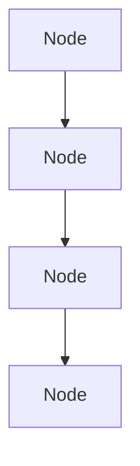
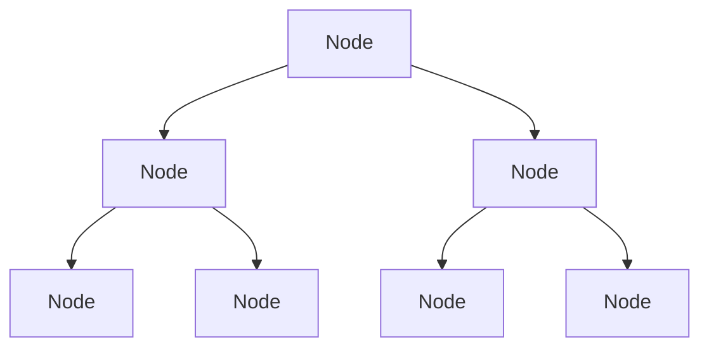
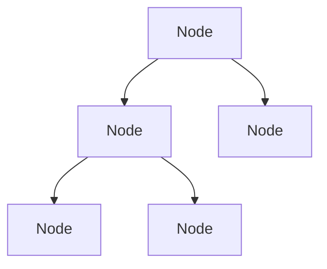
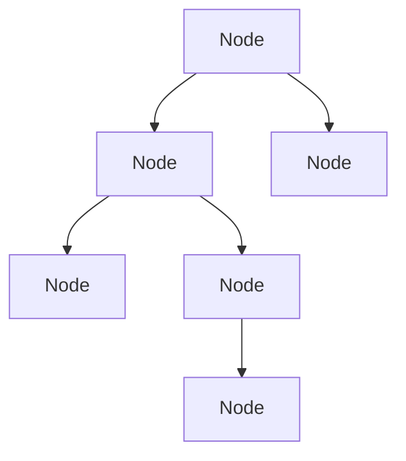
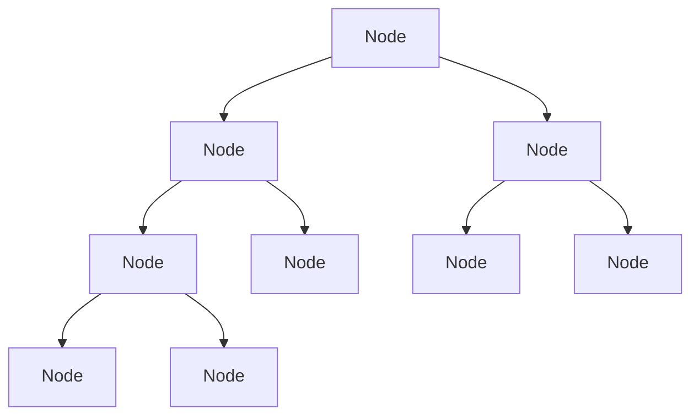
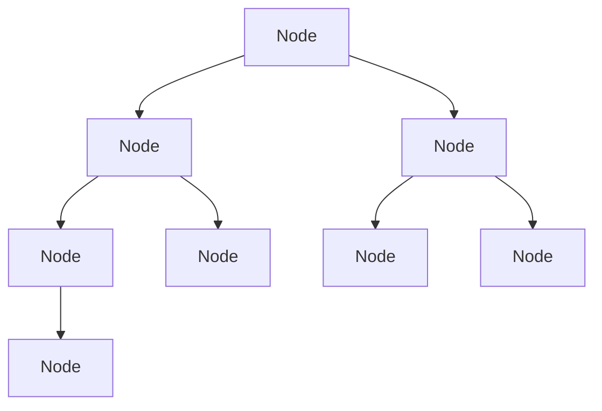

# Trees

## Trees: Intro & Terminology

A tree is a data structure that consists of nodes connected by edges. It is a hierarchical structure with a single root node at the top and child nodes branching out from it. Each node can have zero or more child nodes, and each child node can have its own children, forming a tree-like structure.

We have already seen trees in the form of a linked list, where each node has a pointer to its next node. In a tree, each node can have multiple children, and the relationships between nodes are more complex.

In a linked list, we had:



In a tree, we have:



In code, we can represent a tree using a class for the nodes and a class for the tree itself. Each node will have a value and a list of child nodes. The tree class will have a reference to the root node and methods for adding, removing, and searching for nodes.

```js
{
  value: 4,
  left: null,
  right: null
}
```

A more complex tree might look like this:

```js
{
  value: 4,

  left: {
    value: 3,
    left: null,
    right: null
  },
  right: {
    value: 23,
    left: null,
    right: null
  }
}
```

In this example, the root node has a value of 4, and it has two children: a left child with a value of 3 and a right child with a value of 23. Each child node can also have its own children, forming a tree structure.

We usually deal with binary trees, where each node has at most two children. In a binary tree, we refer to the left child and the right child. In a general tree, we can have any number of children for each node.

There is no rule that a tree has to be binary. However, because we have `left` and `right` properties in our binary tree implementation, we often focus on binary trees for simplicity and efficiency.

A **full binary tree** is a tree in which every node has either 0 or 2 children.



A **non-full binary tree** is a tree in which at least one node has only one child.



A **complete binary tree** is a tree in which every level, except possibly the last, is completely filled, and all nodes are as far left as possible.



A **perfect binary tree** is a tree in which all internal nodes have two children and all leaves are at the same level.


A **balanced binary tree** is a tree in which the height of the left and right subtrees of any node differ by at most one.



The top node in a tree is called the **root** or **parent** node. The nodes below the root are called **children**. The children of a node are called **siblings**. The **children** can also be **parents** of their own children.

A node that does not have any children is called a **leaf** node. Leaf nodes are the endpoints of a tree and do not have any further branches.

## Trees: Binary Search Trees (BST)

A **binary search tree (BST)** is a binary tree in which each node has a value, and the values of the left subtree are less than the value of the parent node, while the values of the right subtree are greater than the value of the parent node. This property allows for efficient searching, insertion, and deletion operations.

Let's say we start of with the **root** node with a value of 47. We want to add the value 76.

If the value that we want to add is greater than the value of the root node, we go to the right. If it is less than the value of the root node, we go to the left.

In our case, 76 is greater than 47, so we go to the right.

Now, we want to add the value 52. 52 is greater than 47, so we go to the right. Since we already have a node with the value of 76, we need to check if 52 is less than or greater than 76. Remember, we are looking for the right place to add the new node and if a value is greater than the value of the parent node, we go to the right. If it is less than the value of the parent node, we go to the left.

In our case, 52 is less than 76, so we go to the left. Since there is no node there, we can add the value of 52.

Now, we want to add the value of 21. 21 is less than 47, so we go to the left. Since there is no node there, we can add the value of 21.

Our tree now looks like this:

```plaintext
        47
       /  \
      21   76
          /
         52
```

We want to add the value of 82. 82 is greater than 47, so we go to the right. 82 is also greater than 76, so we go to the right again. Since there is no node there, we can add the value of 82.

```plaintext
        47
       /  \
      21   76
          / \
         52  82
```

Now, we want to add the value of 18. 18 is less than 47, so we go to the left. 18 is also less than 21, so we go to the left again. Since there is no node there, we can add the value of 18.

```plaintext
        47
       /  \
      21   76
     /    / \
    18   52  82
```

Finally, we add the value of 27. 27 is less than 47, so we go to the left. 27 is greater than 21, so we go to the right. Since there is no node there, we can add the value of 27.

```plaintext
        47
       /  \
      21   76
     / \   / \
    18 27 52 82
```

One thing to point out, all of the items greater than the root node (47) are on the right side of the tree and all of the items less than the root node (47) are on the left side of the tree. This is a property of binary search trees.

## Trees: Binary Search Trees (BST) - Big-O Notation

A binary search tree is a data structure that allows for efficient searching, insertion, and deletion operations. The time complexity of these operations depends on the height of the tree.

In the best case, the tree is balanced, and the height of the tree is log(n), where n is the number of nodes in the tree. In this case, the time complexity for searching, inserting, and deleting a node is O(log n).

In the worst case, the tree is unbalanced, and the height of the tree is n. In this case, the time complexity for searching, inserting, and deleting a node is O(n).

Traversing a tree is a **divide and conquer** algorithm. We divide the tree into two subtrees and conquer each subtree separately. The time complexity for traversing a tree is O(n), where n is the number of nodes in the tree.

Since Big-O notation is a measure of the worst-case scenario, we can say that it provides an upper bound on the time complexity of an algorithm, helping us understand its efficiency in the most unfavorable conditions.

Our best possible scenario is O(log n) and our worst possible scenario is O(n). We usually treat the Big-O notation of a binary search tree as O(log n) because we want to keep our trees balanced. If we don't, we can end up with a linked list, which is O(n).

Effectively, for `lookup`, `insert`, and `delete` operations, we can say that the time complexity is O(log n) in the best case and O(n) in the worst case.

- `insert` is better for a linked list than for a balanced tree.
- `lookup` is better for a binary search tree than for a linked list.
- `delete` is better for a binary search tree than for a linked list.

We are basically giving up the efficiency of `insert` for the efficiency of `lookup` and `delete`. This is a trade-off that we make when we use a binary search tree.

## Trees: Binary Search Trees (BST) - Constructor

```js
// Node class
class Node {
  // constructor for the Node class
  // takes a value as an argument
  constructor(value) {
    // assigns the value to the node
    this.value = value

    // assigns the left child to null
    this.left = null

    // assigns the right child to null
    this.right = null
  }
}

// Binary Search Tree class
class BST {
  // initializes the root of the tree to null
  root = null // root of the tree
}
```

Explanation:

- The `Node` class represents a node in the binary search tree. It has a constructor that takes a value as an argument and assigns it to the `value` property of the node. It also initializes the `left` and `right` properties to null, indicating that the node does not have any children yet.
- The `BST` class represents the binary search tree itself. It has a `root` property that is initialized to null, indicating that the tree is empty at the moment. The `root` property will eventually point to the root node of the tree once we start adding nodes to it.

## Trees: Binary Search Trees (BST) - Insertion

To insert a new node into a binary search tree, we need to follow these steps:

1. Create a new node with the given value.
2. If the tree is empty (i.e., the root is null), set the root to the new node.
3. If the tree is not empty, compare the value of the new node with the value of the current node (starting from the root).
4. If the value of the new node is less than the value of the current node, go to the left child. If the left child is null, set it to the new node. If it is not null, repeat step 3 with the left child as the current node.
5. If the value of the new node is greater than the value of the current node, go to the right child. If the right child is null, set it to the new node. If it is not null, repeat step 3 with the right child as the current node.
6. Repeat steps 3-5 until the new node is inserted into the tree.
7. Return the root of the tree.

Edge cases:

- If the tree is empty, we need to set the root to the new node.
- If the value of the new node is equal to the value of the current node, we do not insert it again. We can choose to ignore it or throw an error, depending on our requirements. However, if in the interview they ask you how to handle duplicates, you can add a `count` property to the node and increment it each time you encounter a duplicate. This way, you can keep track of how many times the value has been inserted into the tree.

Pseudocode:

```plaintext
create a new node with the given value

if the tree is empty (if root === null then root = new node)
    set the root to the new node

create a variable current or temp and set it to the root

while loop (current !== null)
    if the value of the new node === current.value or temp.value
        return undefined

    if the value of the new node < current.value or temp.value
        if current.left === null or temp.left === null
            set the left child to the new node

    else if the value of the new node > current.value or temp.value
        if current.right === null or temp.right === null
            set the right child to the new node

    else
        set current to the left child or right child depending on the value of the new node
```
