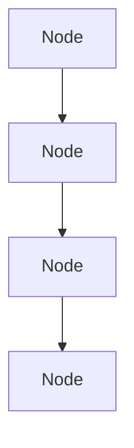
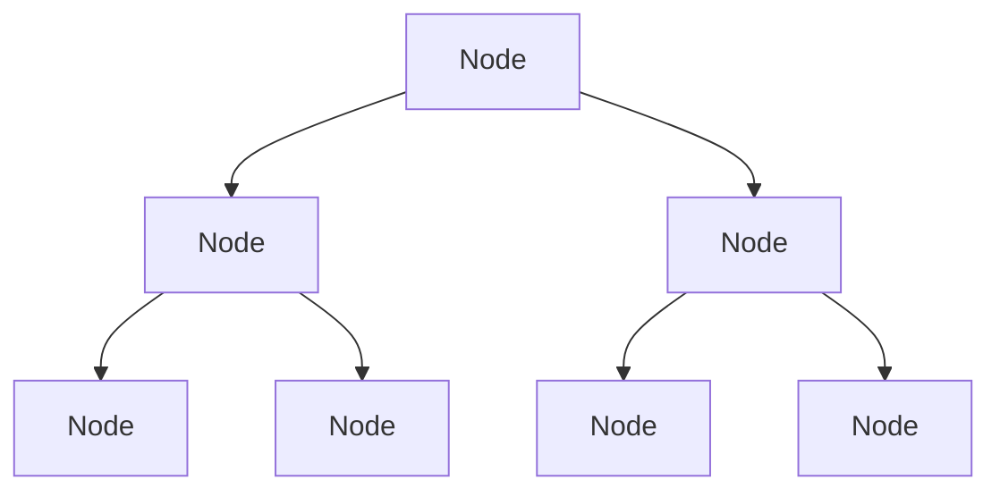
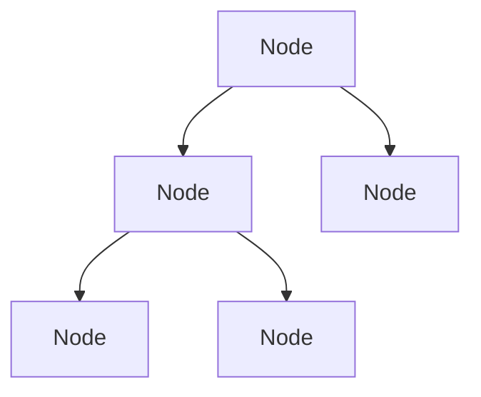
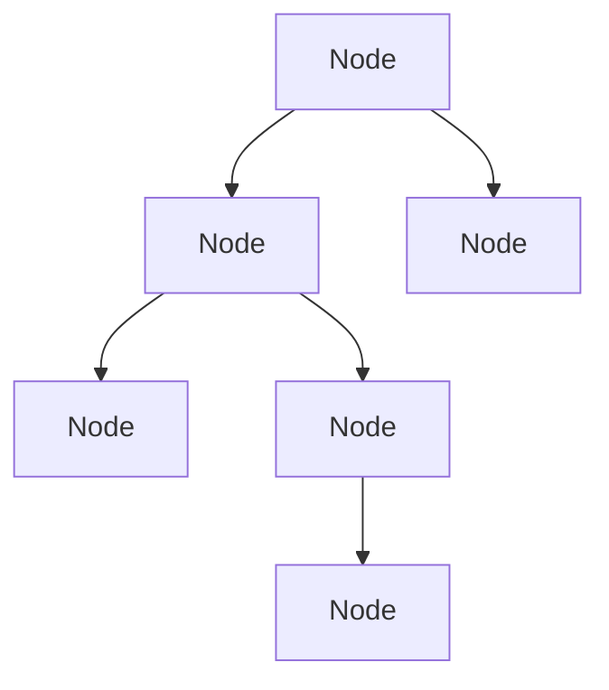
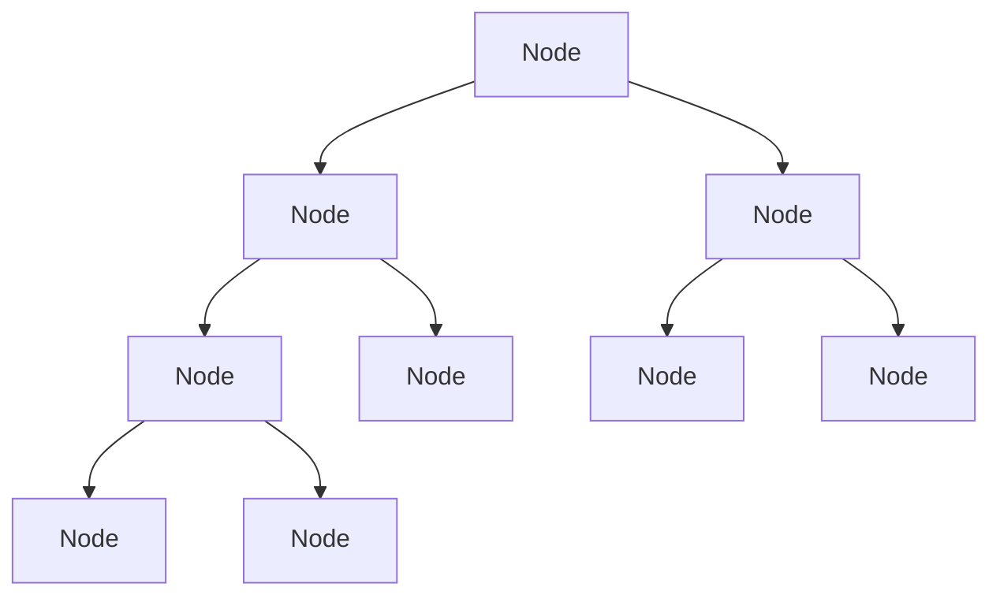
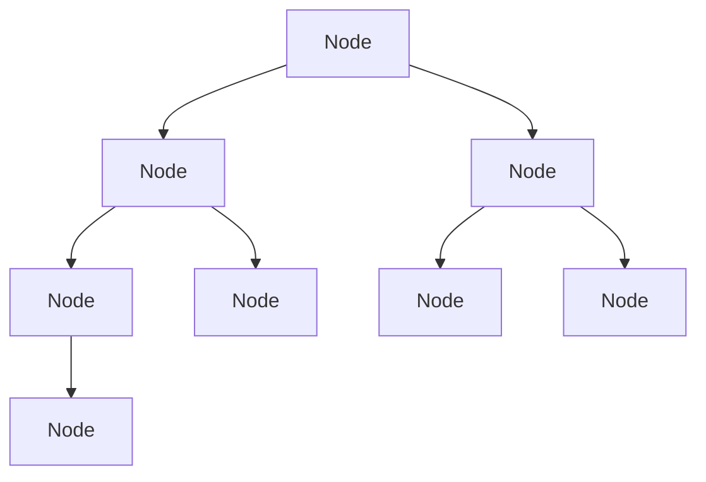

# Trees

## Trees: Intro & Terminology

A tree is a data structure that consists of nodes connected by edges. It is a hierarchical structure with a single root node at the top and child nodes branching out from it. Each node can have zero or more child nodes, and each child node can have its own children, forming a tree-like structure.

We have already seen trees in the form of a linked list, where each node has a pointer to its next node. In a tree, each node can have multiple children, and the relationships between nodes are more complex.

In a linked list, we had:



In a tree, we have:



In code, we can represent a tree using a class for the nodes and a class for the tree itself. Each node will have a value and a list of child nodes. The tree class will have a reference to the root node and methods for adding, removing, and searching for nodes.

```js
{
  value: 4,
  left: null,
  right: null
}
```

A more complex tree might look like this:

```js
{
  value: 4,

  left: {
    value: 3,
    left: null,
    right: null
  },
  right: {
    value: 23,
    left: null,
    right: null
  }
}
```

In this example, the root node has a value of 4, and it has two children: a left child with a value of 3 and a right child with a value of 23. Each child node can also have its own children, forming a tree structure.

We usually deal with binary trees, where each node has at most two children. In a binary tree, we refer to the left child and the right child. In a general tree, we can have any number of children for each node.

There is no rule that a tree has to be binary. However, because we have `left` and `right` properties in our binary tree implementation, we often focus on binary trees for simplicity and efficiency.

A **full binary tree** is a tree in which every node has either 0 or 2 children.



A **non-full binary tree** is a tree in which at least one node has only one child.



A **complete binary tree** is a tree in which every level, except possibly the last, is completely filled, and all nodes are as far left as possible.



A **perfect binary tree** is a tree in which all internal nodes have two children and all leaves are at the same level.


A **balanced binary tree** is a tree in which the height of the left and right subtrees of any node differ by at most one.



The top node in a tree is called the **root** or **parent** node. The nodes below the root are called **children**. The children of a node are called **siblings**. The **children** can also be **parents** of their own children.

A node that does not have any children is called a **leaf** node. Leaf nodes are the endpoints of a tree and do not have any further branches.
